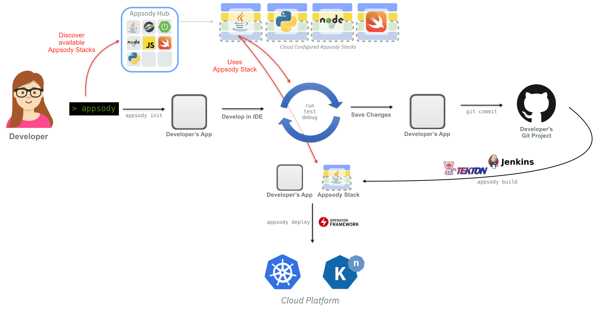
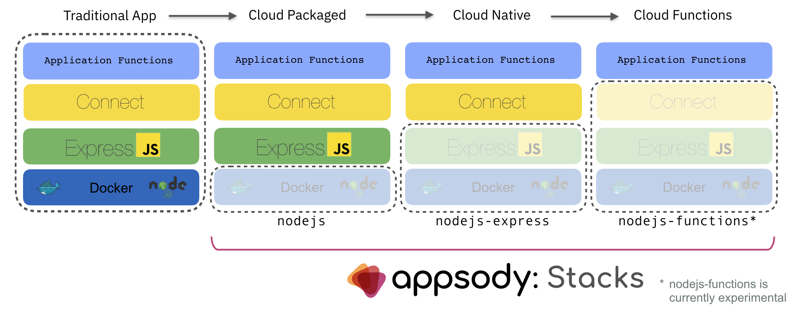

# Building Cloud-Native Apps with Appsody

Appsody provides a set of open source tools and capabilities that simplifies the process of building and deploying applications to Kubernetes that are not just cloud packaged, but that are also cloud native.

To do that, Appsody provides three components:

* Appsody CLI

* Appsody Stacks

* Appsody Deploy

## Appsody CLI

The Appsody CLI provides commands that implement the full development lifecycle. This spans the ability to create a new or enable an existing application using init , to then run, test, and debug, and finally to build an image and deploy it to Kubernetes.

*Appsody Workflow with the Appsody CLI*

All of this occurs in a continuous, local containerized environment. This means that, regardless of your development machine’s operating system, you can immediately verify, test and debug your application in a containerized environment that closely matches your target deployment environment.

Additionally, the local containerized environment supports continuous build and run, meaning that code changes that you make in your application are immediately reflected in the container.

## Appsody Stacks

At the heart of Appsody is the concept of Stacks. These provide pre-built, cloud-optimized development and production configurations for a range of programming languages and microservice frameworks. These are then discoverable and shareable through the Appsody Hub repository.

Building traditional cloud applications means not just creating the application itself, but also building-in cloud-native capabilities. For example, liveness and readiness, metrics and observability, and dynamic configuration. That application then needs to be packaged for cloud using best practise Dockerfiles to create production optimized container images. This requires the accumulation of significant knowledge of how to integrate with cloud capabilities, as well as writing and maintaining the integration code. All of this *could* be delegated, which Appsody does by adding the capabilities into the Appsody Stacks.

Appsody Stacks are designed to provide a spectrum of capabilities dependent on how much of the cloud-native application you want to write yourself, and how much you want to delegate to the Stack.

*Appsody Stacks for Node.js*

At the most simple level, the Appsody Stack provides “**Cloud Packaging**” for your chosen language. This means that you can either bring an existing application or build a new application, and the Appsody Stack not only provides a continuous containerized run, test and debug environment, but can also be used to build a best-practise container image for your application, and then deploy it to a local or remote Kubernetes cluster.

At the next level, the Appsody Stack provides additional built-in “**Cloud Native**” capabilities such as liveness and readiness, metrics and observability. This is achieved by providing a pre-configured microservice or web framework as part of the Stack itself. You can then develop your code using the standard APIs from the framework as you would normally; Appsody then *composes* the application with the Stack to provide a full, containerized microservice.

At the highest level, the Appsody Stack provides “**Cloud Functions**”-like APIs, where the Appsody Stack itself contains a full, cloud-native microservice. You can then develop by writing functions, using either the HTTP APIs provided by the framework or generic APIs such as those provided by Lambda, OpenWhisk and others. Appsody then *composes* with the Stack to provide a full, containerized, microservice with your functions.

This means that you can choose the level of function *you* want to provide, versus what is provided by the Stack. You can, of course, also create your own Stacks — these are just source projects that contain pre-configured microsevice or web frameworks which are built into standard container images.

## Appsody Deploy

Finally, you can build you application into a standard, production-optimized container image using the Appsody build command, or build and deploy the image into Kubernetes using the Appsody deploy command. This makes it easy to test and verify how your application runs when deployed into Kubernetes.

The built container image can then be used in the same way that you would use any other image — enabling you to run it using Docker directly, or to deploy it to any cloud that supports containers.

*Cloud Deploy to Kubernetes using Knative*

Additionally, the Appsody `deploy` command can deploy directly to any Kubernetes cluster that has [Knative Serving](https://knative.dev) installed. The use of Knative serving means that the deployed application scales on request — and down to zero when its not use — and automatically has routes set up for it, so its immediately testable from your browser.

## See it in action

<!-- 
<iframe width="560" height="315" src="https://www.youtube.com/embed/a1ww3W1ZVto" frameborder="0" allowfullscreen></iframe>
 -->
`youtube:https://www.youtube.com/embed/a1ww3W1ZVto`

## Try it out!

You can get started with Appsody using the getting started guide on the Appsody Website, or by using one of the following tutorials that describe how to use some of the Appsody Stacks:

* [How to package your Node.js app with Appsody](https://medium.com/appsody/nodes-cloud-packaged-fe60e29b699d)

* [How to build a Cloud Native Express.js app with Appsody](https://medium.com/appsody/nodejs-express-cloud-native-70022e7d5371)

* [How to make your existing Express.js app Cloud Native with Appsody](https://medium.com/appsody/nodejs-express-enablement-f6fc2609bc00)

For more information on [Appsody](https://appsody.dev), join us on [Slack](http://appsody-slack.eu-gb.mybluemix.net), follow us on [Twitter](https://twitter.com/appsodydev) and star us on [GitHub](https://github.com/appsody).
