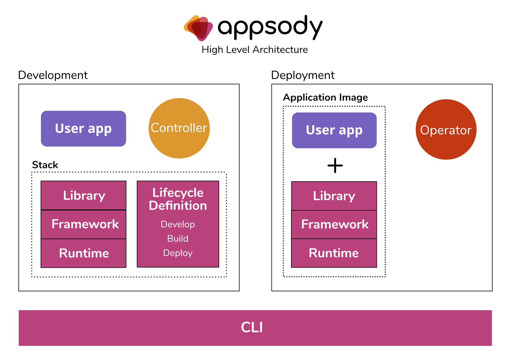

# Welcome to Appsody

Appsody is designed to help you develop containerized applications for the cloud.

If you're a software developer, our aim is to greatly improve your developer experience by removing the burden of managing the full software development stack. With Appsody,
you can build applications for the cloud that are ready to be deployed to Kubernetes without being an expert on the underlying container technology. You can simply focus on the important stuff - developing application code!  

If you're responsible for defining standards for application runtime environments such as software levels, Appsody allows you to control the stacks that your developers use. You can define a set of technologies that are configurable, reusable, and already infused with cloud native capabilities. You get to implement and maintain your standards, ensuring consistency and reliability.

Appsody consists of 3 key components:

### Appsody Stacks
These are configurable technology stacks built with popular runtimes and frameworks, such as *Java with Eclipse MicroProfile* and *Node.js with Express*. These stacks  provide the foundation for building applications that can be deployed and managed effectively in Kubernetes. Stacks allow for rapid development, whilst giving the stack provider the ability to control how the applications are composed. For example, which security policies are applied or which version of a dependency is used. For more
information, see [Appsody Stacks](/docs/stacks/stacks-overview).

### Appsody Hub
The Hub is the central point of control for Appsody Stacks where you can find available stacks, create new stacks, or modify existing ones. You can use the Hub content in the public repo or clone it to provide a private Hub that's based on your requirements. By making changes to the Stacks in the Hub, you can deploy updates to any application that's been built on them, simply by restarting the application.

### Appsody CLI
No project is complete without a nice new CLI to play with. The [Appsody CLI](/docs/using-appsody/cli-commands) is powerful and intuitive, allowing developers to discover the available stacks and bring them into their local development environment. From here, they can build, run, test, and deploy applications locally. The Docker container that's built for an application can then be integrated with Tekton pipelines and deployed to Kubernetes cloud environments. For more information, see [Deploying your app through a Tekton pipeline](/docs/using-appsody/building-and-deploying#Deploying-your-app-through-a-Tekton-pipeline).

## How does it work?

Appsody provides pre-configured application stacks, which use the well-known Dockerfile syntax to specify which language runtimes, frameworks, libraries, and tools are included. Project templates build upon these stacks, providing developers with a templatized application to bring into their IDE of choice and begin development.

When developers run, debug, or test their application using the Appsody CLI, it starts a container with the stack image, makes the development workspace available to the running container, and starts the Appsody controller. The controller is configurable through environment variables in the stack and manages the application within the running container. For example, the controller can watch for changes in the application `/src` directory. When these changes are saved, the controller restarts the application running in a docker container.

## Contributing

We welcome all contributions.

If you'd like to get involved, read our [Contribution guidelines](https://github.com/appsody/website/blob/master/CONTRIBUTING) and come and chat to us in [Slack](https://appsody-slack.eu-gb.mybluemix.net/).

Want to see your framework available as an Appsody Stack? See [Appsody Stacks](./stacks/stacks-overview) and join the `#stack-providers` channel on Slack to introduce yourself!

## License
This project is licensed under the Apache 2.0 license, and all contributed stacks must also be licensed under the Apache 2.0 license. Each contributed stack should include a LICENSE file containing the Apache 2.0 license. More information can be found in the LICENSE file or online at

http://www.apache.org/licenses/LICENSE-2.0
