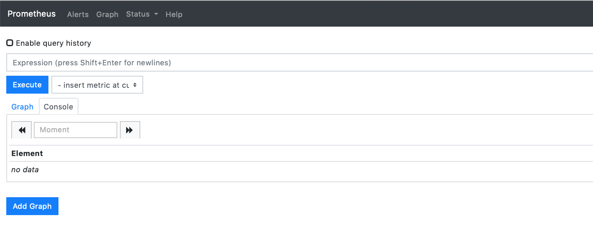
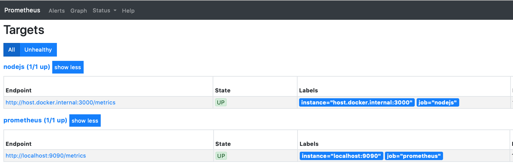
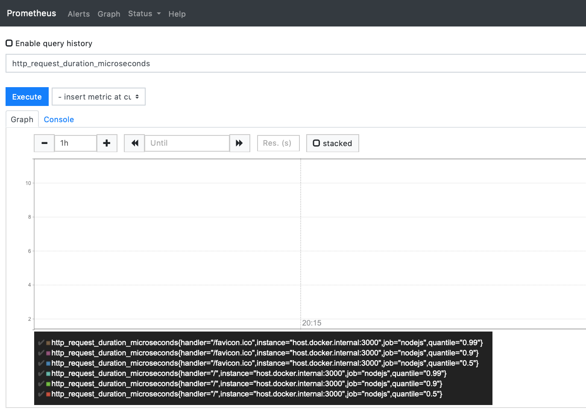
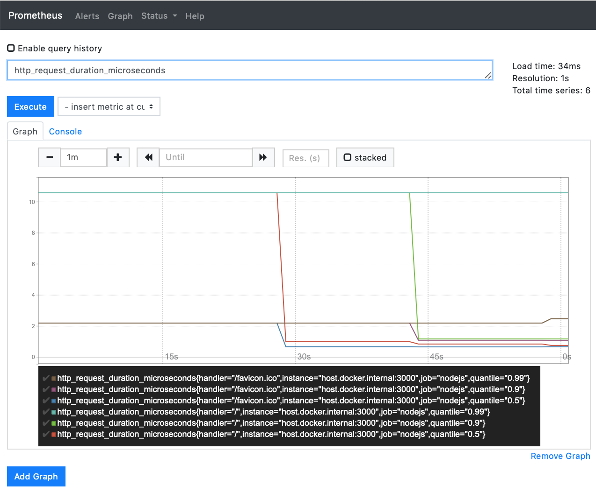
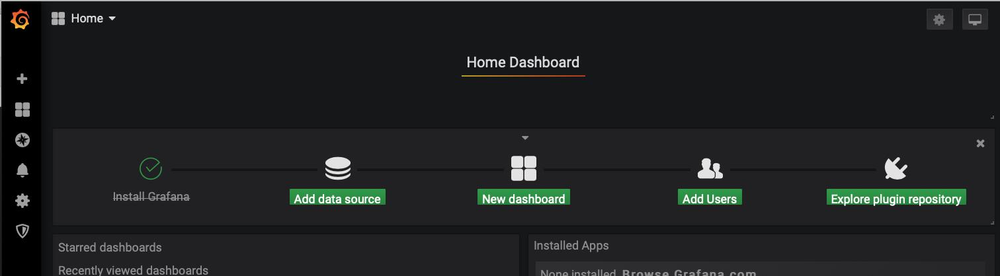
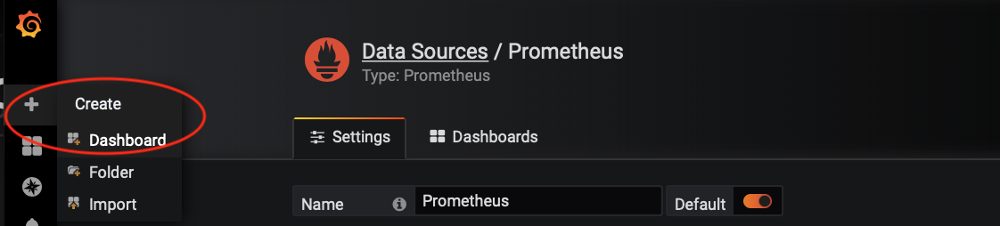
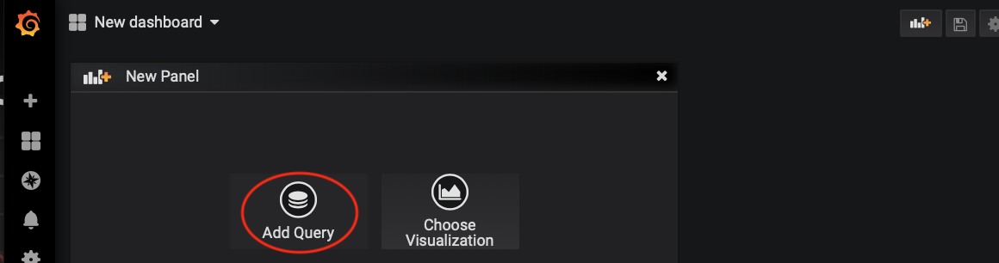
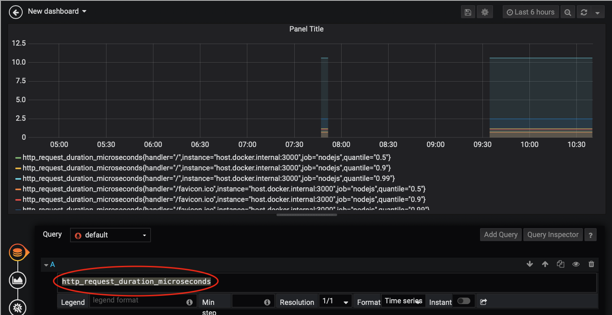
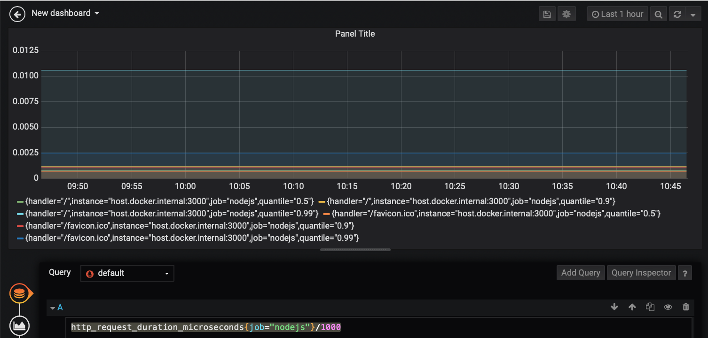
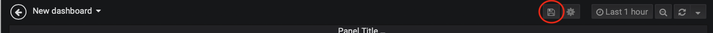

# Build a new Cloud Native Express.js app with Appsody'

The use of Appsody’s tools and provided Stacks simplifies the steps and knowledge required to build “_cloud packaged_”, “_cloud native_” and “_cloud functions_” based applications.

Appsody’s `nodejs-express` Stack makes it easy to go beyond making an application “_cloud packaged_” (which you can see how to do with the basic `nodejs` Appsody Stack). It creates “_cloud native_” applications that use the capabilities of the cloud platform by providing built-in “**Cloud Native**” capabilities such as liveness, readiness, metrics, and observability.

The following tutorial, shows you how to create a new cloud-native Express.js application that uses the `nodejs-express` Stack.

## Prerequisites

To follow this tutorial, you need to install both the Appsody CLI and Docker.

### Install the Appsody CLI

Install the Appsody CLI by following the [Installing Appsody](https://appsody.dev/docs/getting-started/installation) guide for your platform.

## Creating a new application with the `nodejs-express` Appsody Stack

New Appsody based applications are created by using `appsody init <stack> <template>`, where the stack is chosen by you from the stacks that are listed when you run `appsody list`. The `init` command downloads the most recent copy of the Appsody Stack, and populates the project directory with the specified template.

The Express.js Appsody stack provides [two templates: simple and scaffold](https://github.com/appsody/stacks/tree/master/incubator/nodejs-express#templates). Simple, the default template, provides a basic Express app and is used when a template is not specified. The scaffold template has more boilerplate.

The `init` command needs to be run inside in a new project directory. Appsody uses the name of the directory as the default name for the project.

1. Create a new directory for your project:

    ```
    mkdir express-app
    cd express-app
    ```

2. Initialize a new application using the `nodejs-express` Stack:

    ```
    appsody init nodejs-express
    ```

This provides output similar to the following:

    Running appsody init...
    Downloading nodejs-express template project from https://github.com/appsody/stacks/releases/download/nodejs-express-v0.4.6/incubator.nodejs-express.v0.4.6.templates.simple.tar.gz
    Download complete. Extracting files from /Users/helenmasters/test-express-app/nodejs-express.tar.gz
    Setting up the development environment
    Your Appsody project name has been set to express-app
    Pulling docker image docker.io/appsody/nodejs-express:0.4
    Running command: docker pull docker.io/appsody/nodejs-express:0.4
    0.4: Pulling from appsody/nodejs-express
    Digest: sha256:14828ecbd226c9869761a4991911c407465c754e54b5a988c4daa933b6adf4ae
    Status: Image is up to date for appsody/nodejs-express:0.4
    docker.io/appsody/nodejs-express:0.4
    Running command: docker run --rm --entrypoint /bin/bash docker.io/appsody/nodejs-express:0.4 -c "find /project -type f -name .appsody-init.sh"
    Successfully initialized Appsody project with the nodejs-express stack and the default template.

The `init` command downloads the default `simple` project template that provides a basic project structure, along with the latest `nodejs-express Stack` which is a container image that contains:

* A continuous, containerized run, debug, and test environment for use during development.

* A pre-configured Express.js server with built-in cloud-native capabilities.

* A build configuration to provide optimized production-read container images for your application.

Your newly created application contains the following files:

     8 -rw-r — r —  .appsody-config.yaml
     0 drwxr-xr-x   .vscode
     0 drwxr-xr-x   test
     8 -rw-r - r —  app.js
     8 -rw-r — r —  package.json

Where:

* `.appsody-config.yaml` configures the Appsody project, primarily controlling the version(s) of the Appsody Stack that the project can use.

* `.vscode` provides basic integration with VSCode, including adding **Run Task…** entries for the Appsody CLI commands.

* `test` contains a set of tests for the application based on the _mocha_ and _chai_ frameworks.

* `app.js` provides a simple “Hello from Appsody” Express.js route as an example.

* `package.json` configures your application, and allows you to add your own additional module dependencies as normal. The simple template sets the property `"main":` to `"app.js"`.

Looking at the `app.js` file in detail, it contains the following:

```
module.exports = (/*options*/) => {
    const app = require('express')()

    app.get('/', (req, res) => {
      // Use req.log (a `pino` instance) to log JSON:
      req.log.info({message: 'Hello from Appsody!'});
      res.send(“Hello from Appsody!”);
    });

    return app;
};
```

The code creates an instance of an Express.js app, and then registers a handler for `get()` requests on `/` that sends a response of `"Hello from Appsody!"`. It must export a function that returns an Express router or application. The function is called with an `options` argument, which can be ignored. For more information about the `options` argument, see the [`nodejs-express` Stack README](https://github.com/appsody/stacks/tree/master/incubator/nodejs-express). The app is mounted at the application root.

The [express-pino-logger](https://registry.npmjs.org/express-pino-logger) is registered as middleware, so:

 1. All requests are logged as JSON, for easy consumption by log aggregators.
 2. All `req` objects are decorated with a `req.log` property, an instance of [pino](https://registry.npmjs.org/pino). It can be used for application-specific logging. The default log level is 'info' in production, and 'debug' in non-production.

 > The interface for the `nodejs-express` Stack changed in version 0.4. This tutorial has been updated to use the 0.4.6 version of the Stack.

## Developing your application with Appsody

Now that you have created your application, the next step is to see it running. To do that you can use the `appsody run` command in a terminal window. Alternatively, if you use VS Code, you can use the tasks that have been configured in the `.vscode` directory that was added as part of the template project.

1. Run your application by either:

    a) In the terminal, enter: `appsody run`

    b) In VSCode: **Terminal** > **Run Task…** > **Appsody: run**

Whichever method you choose, a continuous development environment is started for your application, running inside a container.

2. Connect to the application in your browser: [http://localhost:3000](http://localhost:3000)

The response is:

```
    Hello from Appsody!
```

In addition to the handler for `get` requests on `/` that was defined in `app.js`, some other capabilities have been added by the Appsody Stack itself. These include health, liveness and readiness endpoints, a metrics endpoint, and an application performance analysis dashboard (during development only).

3. View the additional cloud-native capabilities:

* Health Endpoint: [http://localhost:3000/health](http://localhost:3000/health)

* Liveness Endpoint: [http://localhost:3000/live](http://localhost:3000/live)

* Readiness Endpoint: [http://localhost:3000/ready](http://localhost:3000/ready)

* Metrics Endpoint: [http://localhost:3000/metrics](http://localhost:3000/metrics)

* Performance Dashboard: [http://localhost:3000/appmetrics-dash](http://localhost:3000/appmetrics-dash)

Now that your application is running under `appsody run`, as you make and save code changes in your application, those code changes automatically cause your application to be restarted and the changes reflected in the browser.

4. Make a code change to your project that will be reflected in the browser:

    a) Open the `app.js` file

    b) Change the following line within the file to have six exclamation marks:


```
    res.send(“Hello from Appsody!”);
```


    c) Save the file.

5. Connect to the application in your browser: [http://localhost:3000](http://localhost:3000)

 This displays:


```
    Hello from Appsody!!!!!!
```

6. Finally, stop the continuous run environment by either:

    a) Using **Ctrl-C** in the terminal window where `appsody run` is executing

    b) Running `appsody stop` from the project directory

## Testing, Debugging and Performance Analysing your application

The Appsody CLI also provides `test` and `debug` capabilities, and the built-in Performance Dashboard can be used for performance analysis.

These work in exactly the same way that they do for the base `nodejs` Appsody Stack. You can see how to use those capabilities in the “[Package your Node.js app for Cloud with Appsody](https://medium.com/appsody/nodes-cloud-packaged-fe60e29b699d)” article.

## Using the Metrics endpoint on `/metrics`

The Metrics endpoint that is automatically added as part of the nodejs-express Stack is designed to work with the [Prometheus](https://prometheus.io) open source monitoring system.

While Prometheus can be run anywhere, it is also designed to integrate easily into a Kubernetes environment, and has been embraced by Kubernetes itself — with many of its components exposing metrics for Prometheus to collect.

This means that, once deployed into Kubernetes, you can visualize data both from your application, and from Kubernetes itself.

## Installing and configuring Prometheus

An instance of Prometheus can easily be setup locally by running it in a container, using its container image from DockerHub. To do that, you first need to setup a configuration file to tell Prometheus what to monitor, and then run with that file:

1. Create a file called `prometheus.yml` that contains the following:

```
    # my global config
    global:
      scrape_interval: 15s # Set the scrape interval to every 15 seconds. Default is every 1 minute.
      evaluation_interval: 15s # Evaluate rules every 15 seconds. The default is every 1 minute.
     # scrape_timeout is set to the global default (10s).

    # A scrape configuration containing exactly one endpoint to scrape:
    scrape_configs:
     # The job name is added as a label `job=<job_name>` to any time series scraped from this config.
      - job_name: 'prometheus'
        static_configs:
        - targets: ['localhost:9090']

      - job_name: 'nodejs-app'
        static_configs:
        - targets: ['host.docker.internal:3000']
```

The `scrape_configs` section tells Prometheus which applications to monitor, their location and port. By default, Prometheus will make `http` requests on `/metrics`.

Note that for our `nodejs-app` app, the target has an address of `host.docker.internal`. This is a special address that tells Docker to connect to the localhost of the machine on which the docker container is running.

2. Run Prometheus in a container using docker:

    ```
    docker run --rm -d -p 9090:9090 --name=prometheus -v $PWD/prometheus.yml:/etc/prometheus/prometheus.yml prom/prometheus
    ```

3. Connect to Prometheus in your browser: [http://localhost:9090](http://localhost:9090)

The following view is shown where you can display graphs and data:

*Prometheus Dashboard View*

Before doing that, first see what “targets” Prometheus is collecting data from:

4. Select **Status** > **Targets**

This shows a list of two servers that Prometheus is collecting data from:

*Prometheus Target Status View*

This show that Prometheus is collecting data itself as well as your application, and that both have a state of UP.

5. Select **Graph** to switch back to the Graph view, and then display some data:
 a) Enter `http_request_duration_microseconds` in the **Expression** box
 b) Click on the **Graph** tab

This displays a graph of the the performance of requests to various HTTP endpoints in your application:

*Prometheus Graph View with Request Duration Data*

This shows that Prometheus has data for requests against `/` and `/favicon.ico`.

6. Next, make some requests of your application in your browser, and refresh the Graph page in the Prometheus dashboard

*Prometheus Graph View with Request Duration Data*

The graph now shows the variation in performance as the application is responding to ongoing requests.

Prometheus provides the ability to build simple graphs and alerts. However, it is also designed to be used with more advanced graphing and dashboarding solutions. The most frequently used being Grafana.

### Installing Grafana

[Grafana](https://grafana.com) can also easily be setup and run locally using its container image from DockerHub, you can then connect it to the running Prometheus instance. To do that, you first need to run Grafana itself, and then configure it to use your Prometheus server so that it has access to the data that Prometheus is collecting.

1. Run Grafana in a container using `docker`:

    ```
    docker run --rm -d -p 3001:3000 --name=grafana -e “GF_SECURITY_ADMIN_PASSWORD=password” grafana/grafana
    ```

2. Open the Grafana console: [http://localhost:3001](http://localhost:3001)

3. Login with the following credentials:

* Username: admin

* Password: password

*Grafana Login Page*

> The password of `password` was set using the `GF_SECURITY_ADMIN_PASSWORD` value when you started the Grafana server using `docker`. If this doesn't work, you might find `Username: admin` with `Password: admin` works, which then prompts you to change your password.

4. In the Home Dashboard display, click on **Add data source**:

*Adding a data source in Grafana*

5. Select the **Prometheus** icon for the data source type:

*Selecting the Prometheus data source*

6. Enter a **URL** of http://host.docker.internal:9090and click **Save & Test**:

*Setting the data source values in Grafana*

7. Select the **+** button on the left hand side-bar and click on **Dashboard**:

*Creating a new Dashboard in Grafana*

This creates a new dashboard for you, in which you can start to create panels to display visualizations, queries and data.

8. Click on the **Add Query** icon

*Add a new panel using Add Query*

This opens a new query and visualization panel.

9. In the entry box next to **A**, enter the following query:

    ```
    http_request_duration_microseconds
    ```

and then click on the graph at the top of the panel.

*Adding a query and creating a graph*

It now displays a chart of the HTTP responsiveness for all of the applications that Prometheus is collecting data from.

10. Add a filter and calculation to the query so that it only displays data from your application by modifying the query to the following:

    ```
    http_request_duration_microseconds{job=”nodejs-app”}/1000
    ```

and then click on the graph at the top of the panel.

*Filtered graph, displayed in milliseconds*

This has filtered the graph to only display data from the application with the job name of `nodejs-app` — this is the value you set for your application in the `prometheus.yml` file when you started Prometheus — and then divides the data by 1000 to give a time in milliseconds rather than microseconds.

11. Finally, click the **Disk** icon at the top of the window to save your dashboard, giving it a name and clicking on the **Save** button.

*Save the Dashboard*

Grafana makes it possible to build rich and dynamic dashboards so that you can visualize your data however you wish. It also lets you import pre-built dashboards.

To see the catalog of available dashboards, visit the [Dashboards](https://grafana.com/dashboards) page on Grafana.com.

### Cleaning Up

Finally, to shut down Prometheus and Grafana, you need to stop their running containers. You can do that with the following two commands:

```
docker stop prometheus
docker stop grafana
```

## Next Steps

This tutorial covered how to build a new “Cloud-Native” Express.js application using the `nodejs-express` Appsody Stack which automatically provides the application with cloud-native capabilities such as liveness and readiness checks, along with metrics and observability.

For more information on [Appsody](https://appsody.dev), join us on [Slack](http://appsody-slack.eu-gb.mybluemix.net), follow us on [Twitter](https://twitter.com/appsodydev) and star us on [GitHub](https://github.com/appsody).
