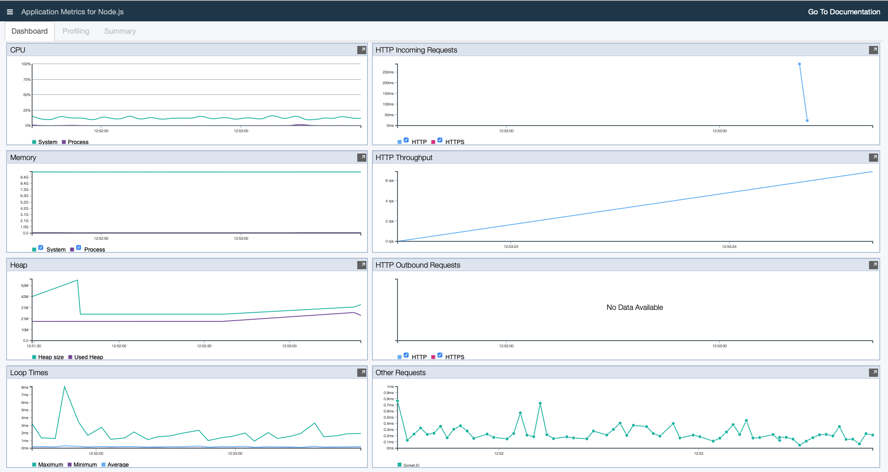
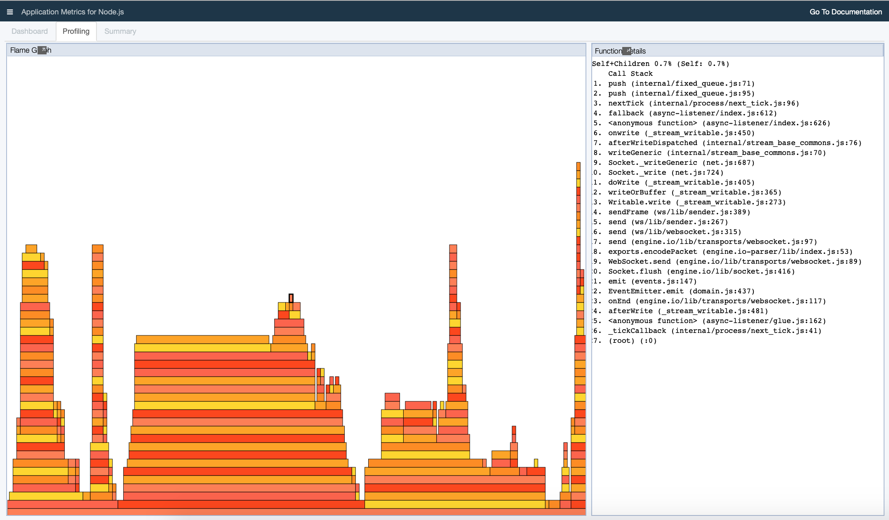
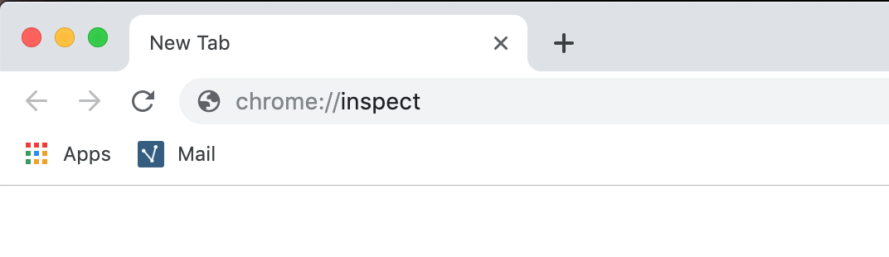
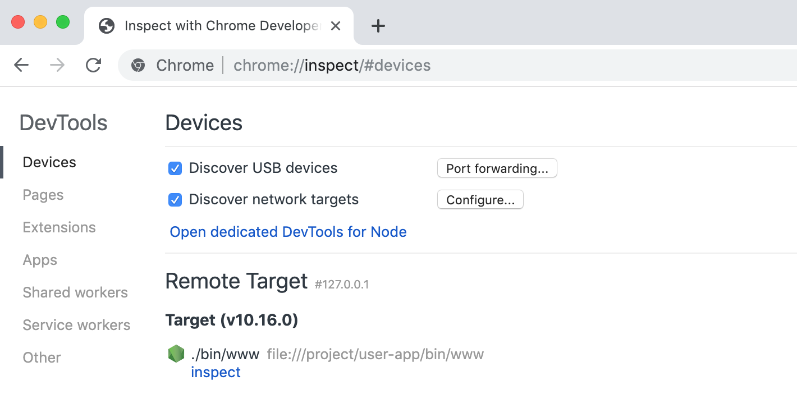

# Package your Node.js app for Cloud with Appsody

The use of [Appsody](http://www.appsody.dev)'s tools and provided Stacks simplifies the steps and knowledge required to build _"cloud packaged"_, _"cloud native"_ and _"cloud functions"_ based applications.

Appsody's `nodejs` Stack makes it easy to take any existing Node.js application and make it _"cloud packaged"_.

The following tutorial, shows you how to take a sample Node.js application, and package it into a best-practise container image using the Appsody CLI and the `nodejs` Stack.

## Prerequisites

To follow this tutorial, you need to install both the **Appsody CLI** and **Docker**. You also need a Node.js application to cloud package.

### Install the Appsody CLI

Install the Appsody CLI by following the [Installing Appsody](https://appsody.dev/docs/getting-started/installation) guide for your platform.

### Create a sample application

You need a Node.js app to package. You can either use one you already have, or create a sample Express.js app by using the following steps:

1. Install the [Express.js Application Generator](http://expressjs.com/en/starter/generator.html):
```
    npm install -g express-generator
```
2. Create a directory for your application:
```
    mkdir nodejs-app
    cd nodejs-app
```
3. Run the Express Application Generator to build a sample application:
```
    express
```
4. Run your generated Express.js application:
```
    npm install
    npm start
```
5. Open your browser to see the application running: [http://localhost:3000](http://localhost:3000)

 This displays the following output:

*Express: Welcome to Express*

6. Stop the Express.js application using **Ctrl-C**

Your sample application is now ready to use!

## Enabling your application with the `nodejs` Appsody Stack

New Appsody based applications are created by using `appsody init <stack>`, where the stack is chosen by you from the stacks that are listed when you run `appsody list`. The init command downloads the most recent copy of the Appsody Stack, and populates the project directory with a template that provides a basic project structure.

In order to enable an existing application with a stack, the same steps can be followed, but passing the option `none` to `appsody init`, as a project structure is not required.

1. Enable the Node.js Application:
```
    appsody init nodejs none
```
This provides output similar to the following:
```
Checking stack requirements...
Docker requirements met
Appsody requirements met
Running appsody init...
Downloading nodejs template project from https://github.com/appsody/stacks/releases/download/nodejs-v0.3.5/incubator.nodejs.v0.3.5.templates.simple.tar.gz
Download complete. Do not unzip the template project. Only extracting .appsody-config.yaml file from /Users/kyemaloy/nodejs-app-2/nodejs.tar.gz
Setting up the development environment
Your Appsody project name has been set to nodejs-app-2
Pulling docker image docker.io/appsody/nodejs:0.3
Running command: docker pull docker.io/appsody/nodejs:0.3
0.3: Pulling from appsody/nodejs
Digest: sha256:c0bc3aef3a2d5a631acfebc8fc33e2dfc230c37a0783d5ae2b6d61f93af1fe39
Status: Image is up to date for appsody/nodejs:0.3
docker.io/appsody/nodejs:0.3
Running command: docker run --rm --entrypoint /bin/bash docker.io/appsody/nodejs:0.3 -c "find /project -type f -name .appsody-init.sh"
Successfully initialized Appsody project with the nodejs stack and no template.
```
As well as downloading the latest version of the Appsody Stack (in this case version 0.3), this has added a `.appsody-config.yaml` file to the project, which configures the versions of the Stack that the project will use.

At this point, your application has been enabled, which means you can now run, test and debug your application in a continuous containerized environment provided by the Appsody Stack, to build it into a optimized container image, and to deploy it to Kubernetes.

## Developing your application with Appsody

Now that your application has been enabled, you can use the `run`, `test` and `debug` commands to the Appsody CLI to work with your application in a continuous containerized environment provided by the Appsody Stack.

### Working with your application

Appsody's run command provides a continuous development environment, where changes that are saved to your project cause your application to be restarted. This is similar to the experience you get from tools like [nodemon](https://nodemon.io), but this occurs inside the containerized environment. The only requirement is that your application's `package.json` file needs to include a **start** script.

The following steps show you how that works for your application:

1. Open your application in your favourite IDE

Alternatively you can open a second terminal window so that you can edit the application files.

2. Start the continuous run environment, by using the Appsody CLI in the terminal window:
```
    appsody run
```
3. Open your browser to see the application running: [http://localhost:3000](http://localhost:3000)
 This will display:


As `appsody run` provides a continuous development environment, any code changes you make will cause an automatic restart of the application.

4. Make a code change to your project that will be reflected in the browser:

a) Open **views** > **index.jade**

b) Change the file contents to:
```
    extends layout

    block content
      h1= title
      p Welcome to #{title}!!!!!!!
```
c) Save the file

5. Open your browser to see the application running: [http://localhost:3000](http://localhost:3000)
 This will display:

*Express: Welcome to Express!!!!!!!*

> You may need to refresh the page to see the change.

This provides a continuous, containerized development environment where you can almost instantly see any changes you make reflected in the application running in the browser.

### Carrying out Performance Analysis of your application

As part of the development environment, both appsody run and appsody debug also provide a performance monitoring and profiling dashboard that uses the [appmetrics-dash](https://www.npmjs.com/package/appmetrics-dash) module. This feature is available during development only and it enables you to do analysis of your application.

1. Open the Performance dashboard: [http://localhost:3000/appmetrics-dash/](http://localhost:3000/appmetrics-dash/)

This provides a display similar to the following, which provides data for:

* HTTP request responsiveness and HTTP throughput

* Performance of outbound HTTP requests and other requests

* Event Loop latency showing the delay before tasks are scheduled.

* CPU and Memory usage for the process and the system

*Performance Monitoring and Analysis Dashboard*

2. Click on the **Profiling** tab to open the profiling view

3. Click on the "**Hamburger Menu**" (the three horizontal lines in the top left-hand corner" and select **Enable Profiling**

This starts to collect function profiling data from the application, and to visualize it using a _[flame graph](http://www.brendangregg.com/flamegraphs.html)_, which provides a visualization of the stacks and functions that are using most CPU time.

*Flame Graph generated from Performance Profiling Data*

4. Click on the "**Hamburger Menu**"(the three horizontal lines in the top left hand corner) and select **Disable Profiling**

As well as providing performance monitoring and profiling, you can also trigger Heap Dumps and [Node Reports](https://github.com/nodejs/node-report) through the menu, and see an overview of your application in the Summary tab.

5. Finally, stop the continuous `run` environment by either:

* Using **Ctrl-C** in the terminal window where `appsody run` is executing

* Running `appsody stop` from the project directory

### Debugging your application

Appsody's `debug` command provides the same continuous development environment that you get with the run environment. In addition, the application runs in debug and provides the correct configuration to enable remote access from a local debugger.

The following steps show you how that works for your application:

1. Open your application in your favourite IDE

 Alternatively you can open a second terminal window so that you can edit the application files.

1. Start the continuous debug environment, by using the Appsody CLI in the terminal window:
```
    apposody debug
```
3. Open your browser to see the application running: [http://localhost:3000](http://localhost:3000)
 This will display:

*Express: Welcome to Express!!!!!!!*

As `appsody debug` provides a continuous development environment, any code changes you make will cause an automatic restart of the application. It also sets up the container to allow remote access from a debugger.

4. Attach a debugger to your application

 You can either use your favourite debugger for this, or use the one integrated into the Chrome Browser as follows:

 1. Open the Chrome Browser

 2. Enter chrome://inspect in the URL bar

*chrome://inspect in the search bar*

It displays a view similar to the following in the window:

*Available targets to inspect with the Chrome Debugger*

3. Select the **inspect** link for the application shown under **Remote Target**

This will then open a new panel containing the debugger, attached to your application running inside the continues containerized debug environment.

You can now debug as you would normally. Additionally, any code change that you make to the project through changes to its source code with automatically stop and restart your application (after which you will need to restart the debugger connection).

4. Finally, stop the continuous debug environment by either:

* Using **Ctrl-C** in the terminal window where `appsody debug` is executing

* Running `appsody stop` from the project directory

### Testing your application

Appsody's `test` command makes it possible to run any tests that your application has inside the containerized environment. To use this capability, your application needs to be provided with some tests, and your **package.json** file needs to include a **test** script that runs them.

The steps below show how that works for your application. As the sample application created from the Express Application Generate does not include any tests, you first need to add one.

1. Replace your **package.json** file with the following code. This will add devDependencies for chai, mocha and request, and add a test script:
```
    {
      "name": "test",
      "version": "0.0.0",
      "private": true,
      "scripts": {
        "start": "node ./bin/www",
        "test": "mocha"
      },
      "dependencies": {
        "cookie-parser": "~1.4.4",
        "debug": "~2.6.9",
        "express": "~4.16.1",
        "http-errors": "~1.6.3",
        "jade": "~1.11.0",
        "morgan": "~1.9.1"
      },
        "devDependencies": {
        "chai": "4.2.0",
        "mocha": "~6.1.0",
        "request": "2.88.0"
      }
    }
```
2. Create a new **test** directory in your project:
```
    mkdir test
    cd test
```
3. Create a new **test** > **test.js **file containing:
```
    const expect = require('chai').expect;
    const request = require('request');
    const app = require('../app');
    var http = require('http');

    const PORT = process.env.PORT || '3000';
    const server = app.listen(PORT);
    const url = "http://localhost:" + PORT;

    describe("Node.js Stack", function () {

      // Testing / responds with 200 OK
      describe('/ endpoint OK', function () {
        it('status', function (done) {
          request(url + '/', function (error, response, body) {
            expect(response.statusCode).to.equal(200);
            done();
          });
        });
      });
    });

    // Stop the server after testing
    after(done => {
      server.close(done);
    });
```
4. Check that the tests are running locally:
```
    npm install
    npm test
```
This will respond with output similar to the following:
```
    Node.js Stack
    / endpoint OK
    GET / 200 309.872 ms — 170
    ✓ status (341ms)

    1 passing (354ms)
```
5. Run the tests using the Appsody test mode:
```
    appsody test
```
This will respond with output that includes the following:
```
    [Container] > test@0.0.0 test /project/user-app
    [Container] > mocha
    [Container]
    [Container]
    [Container]
    [Container] Node.js Stack
    [Container] / endpoint OK
    [Container] GET / 200 320.079 ms — 170
    [Container] null
    [Container] ✓ status (359ms)
    [Container]
    [Container]
    [Container] 1 passing (375ms)
```
Note that, unlike `run` and `debug`, `test` executes a single run of the tests rather than a continuous container.

## Building your application with Appsody

Once you have reached a point that you would like to build a deployable container image for your application, you can do that using `appsody build`. This creates a production-optimized image that is built using the regular ["node" Official Docker image](https://hub.docker.com/_/node) from the Node.js community and then rebased on the communities "node-slim" image. The "node-slim" image is both significantly smaller that the regular "node" image, making it easier and faster to deploy to a cloud, and more secure because it does not include packages like compilers (which are required in the regular "node" image to allow you to use packages with native add-ons).

The steps below show how to build the container image for your application, and then run it locally using Docker:

1. Build the container image for your application:
```
    appsody build
```
This builds a container image for your application, using the name of your project as the "tag" (which is the name of the folder in which is resides). One of the final lines of the output gives the name of the image, usually just above the running command outputs:
```
    Built docker image dev.local/nodejs-app
```
2. Run the container image using Docker:
```
    docker run --rm -it -p 3000:3000 dev.local/nodejs-app
```
This runs your container image, using the `-p` option to map port 3000 from the container to port 3000 on your machine, the `-i` option to run interactively (so you can use **Ctrl-C** to stop the container), the `--rm` option to remove the container when its stopped, and the `-t` option to run the container image with our "tag" of nodejs-app.

3. Open your browser to see the application running: [http://localhost:3000](http://localhost:3000)

Note that the Performance Dashboard is not present, as it was injected as a development-only feature.

4. Finally, stop the container by using **Ctrl-C** in the terminal window where `docker run` is executing.

You now have a cloud packaged available in a container image that is ready to be deployed to any cloud that supports container images.

You can also use the `appsody deploy` command to [deploy the image to any Kubernetes cluster](https://appsody.dev/docs/using-appsody/building-and-deploying).

## Next Steps

This article covered how to take an existing Node.js application and make it "*Cloud Packaged*" using the `nodejs` Appsody Stack. Appsody also provides a higher level `nodejs-express` stack that additionally provides a pre-configured Express.js server that includes cloud-native capabilities such as liveness and readiness checks, along with metrics and observability.

For more information on [Appsody](https://appsody.dev), join us on [Slack](http://appsody-slack.eu-gb.mybluemix.net), follow us on [Twitter](https://twitter.com/appsodydev) and star us on [GitHub](https://github.com/appsody).
