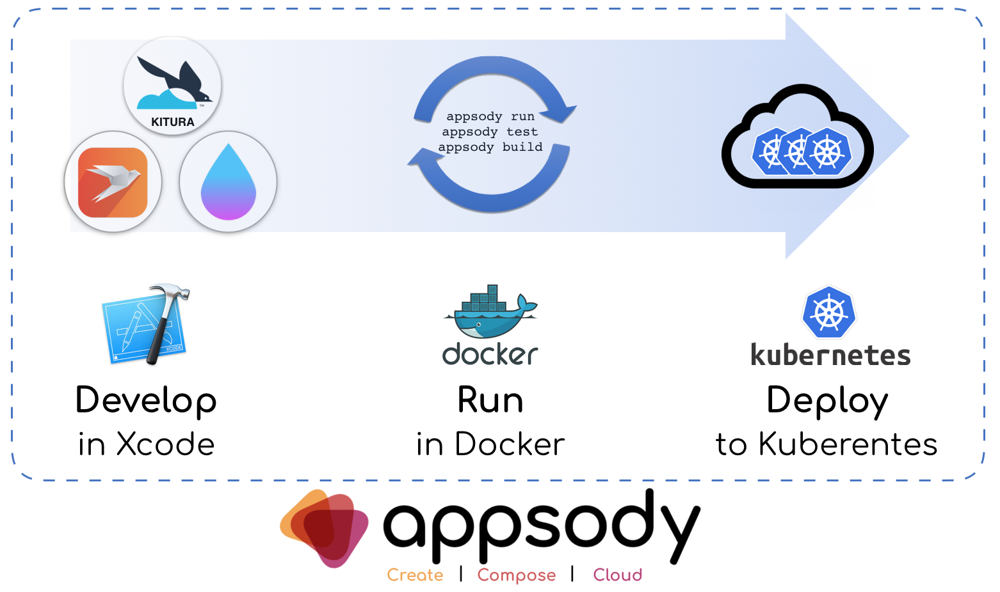

# Server-Swift Swift: Develop in Xcode, continuously verify in Docker

Due to the availability of the Swift Language Server Protocol (LSP) library, there are now more IDEs that you can use to develop server-side Swift applications, including VSCode on Linux. Undoubtedly though, most development is still done by using Xcode on macOS.

While this is great in terms of support for the Swift language — and with the support for Swift Package Manager added in Xcode 11, for package management — there is still the challenge of ensuring that the APIs, frameworks, and packages that you are using on macOS are supported and work in the same way on Linux.

The new support for Swift in the Appsody cloud-native development tools helps to solve that challenge, as you can continuously run and test your code in a Docker container as you develop in Xcode.

*Develop in Xcode, Verify in Docker, Deploy to Kubernetes*

This means that, as you develop in Xcode, or any other IDE, your code is mirrored into a Docker container which rebuilds every time you save your code changes. You can see immediately whether your code changes fail or have different behavior on Linux.

The tutorial shows you how to run your project in the Appsody environment in parallel to working in Xcode.

## Prerequisites

To follow this tutorial, you need to install both the Appsody CLI and Docker. You also need a Swift application; the tutorial walks you through two ways of creating a Swift app if you don't have one already.

#### Install Docker

It is recommended that you install Docker by using [Docker Desktop for Mac](https://docs.docker.com/docker-for-mac/install/), which is available as a download from Docker Hub.

#### Install the Appsody CLI

Install the Appsody CLI by following the [Installing Appsody](https://appsody.dev/docs/getting-started/installation) guide. On macOS, you can install using Homebrew:

```
brew install appsody/appsody/appsody
```

#### Create a sample application

Next, you need a server-side Swift application. You can either use one you already have, or create a sample application by using one of the two following approaches:

##### Option 1: Create a sample application using Kitura

You can create a sample application using the Kitura CLI by following the [Create a server with the Kitura CLI](https://www.kitura.io/docs/getting-started/create-server-cli) guide, or you can use the Swift Package Manager by following the [Create a server with Swift Package Manager](https://www.kitura.io/docs/getting-started/create-server-spm) guide. The following steps show how to use the CLI:

1. Install the Kitura CLI using Homebrew:

    ```
    brew install ibm-swift/kitura/kitura
    ```

2. Create a directory for your Swift project:

    ```
    mkdir ~/swiftapp
    ```

    ```
    cd ~/swiftapp
    ```

3. Create a Kitura application:

    ```
    kitura init
    ```

##### Option 2: Create a sample application using Vapor

You can create a sample application using the Vapor CLI by following the [Install on macOS](https://docs.vapor.codes/2.0/getting-started/install-on-macos/) guide to install the CLI, followed by the [Hello, World](https://docs.vapor.codes/2.0/getting-started/hello-world/) guide to create your application. The following steps summarize those actions:

1. Install the Vapor CLI using Homebrew:

    ```
    brew install vapor/tap/vapor
    ```

2. Make sure that you are in your home directory:

    ```
    cd ~
    ```

3. Create a Vapor application:

    ```
    vapor new swiftapp
    ```

    ```
    cd swiftapp
    ```

4. Create an Xcode Project for your app (only required for Xcode 10 and before):

    ```
    swift package generate-xcodeproj
    ```

## Enabling your application to work with Appsody

New Appsody based applications are created by using `appsody init <stack> <template>`, where the stack and template are both chosen by you from those that are listed when you run `appsody list`. The `init` command downloads the most recent copy of the Appsody Stack - essentially the development and build environment for that language - and populates the project directory with a template that provides a basic project structure.

To enable an existing application with a stack, the same steps can be followed, with one difference, you need to use a template name of `none` with the `appsody init` command.

1. Enable the Swift Application:

    ```
    appsody init swift none
    ```

This will print output similar to the following to the console:

```
    Running appsody init...

    Downloading swift template project from [https://github.com/appsody/stacks/releases/download/swift-v0.1.4/incubator.swift.templates.simple.tar.gz](https://github.com/appsody/stacks/releases/download/swift-v0.1.4/incubator.swift.templates.simple.tar.gz)
    Download complete. Extracting files from swift.tar.gz
    Setting up the development environment
    Running command: docker[pull appsody/swift:0.1]
    Running command: docker[run --rm --entrypoint /bin/bash appsody/swift:0.1 -c find /project -type f -name .appsody-init.sh]
    Successfully initialized Appsody project with the swift stack and no template.
```

The `init` command downloads the latest version of the Appsody Stack (in this case version 0.1), and adds an **.appsody-config.yaml** file to the project, which defines the versions of the Stack that the project will use.

Your application is now enabled, which means that you can run, test and debug your application in the continuous containerized environment that is provided by the Appsody Stack. You can then build your app into an optimized container image, and deploy it to Kubernetes.

## Developing your application with Appsody

Now you can use the Appsody CLI's run, test, and debug commands to work with your application in the continuous containerized environment provided by the Appsody Stack.

The `appsody run` command provides a continuous development environment, where changes that are saved to your project cause your application to be restarted.

1. First, open your project in Xcode so that you can start making code changes to your project:

* Xcode 10 and earlier:

    ```
    cd ~/swiftapp
    ```

    ```
    xed .
    ```

* Xcode 11 and beyond:

    ```
    cd ~/swiftapp
    ```

    ```
    open Package.swift
    ```

2. Next, start the continuous run environment:

    ```
    appsody run
    ```

> The `appsody run` command builds and runs your application in a Docker container. The first run might take a couple of minutes as it downloads and builds your application for the first time, but subsequent runs cache that data.

3. Finally, open your browser to see your Swift application running inside the Docker container: [http://localhost:8080](http://localhost:8080)

If you are running the Kitura sample app, the output is as follows:


*“Your Kitura server is up and running!” — Success from Kitura App*

However, if you are running Vapor, the web page fails to load and you see an error. Vapor apps accept requests from localhost only by default. The Docker container does not see your host machine (for example, your MacBook) as localhost, so you need to enable remote connections.

You can enable remote connections by adding the following code snippet into `Sources/App/app.swift` in Xcode:

```
    let serverConfig = NIOServerConfig.default(hostname: "0.0.0.0")
    services.register(serverConfig)
```

As `appsody run` provides a continuous development environment, any code changes you make cause an automatic restart of the application. Go back to your browser and see if you can connect to your app now. The expected output is:

*“It works!” — Success from Vapor App in Appsody*

4. Next, you are going to make a code change to your project that you can then see reflected in the browser.

With Appsody, any code changes that you make are reflected immediately. If you’re using Vapor, you saw this feature when you enabled requests from non-localhost addresses to be handled.

For Kitura, a simple code change to demonstrate this is to remove the Health Route.

> By default, Kitura provides a /health route that responds with the status of the Kitura server. It is provided because many clouds and cloud technologies, like Kubernetes, can use it to determine whether the application needs to be automatically restarted.

Edit `Sources/Application/Application.swift` and remove the following line:

```
initializeHealthRoutes(app: self)
```

Save the file, and open [http://localhost:8080/health](http://localhost:8080/health) to see that the route is no longer present!

## Working with your application in Test mode

Appsody’s test mode runs any tests that your application has inside the containerized environment.

Run the tests by using the Appsody test mode:

  ```
  appsody test
  ```

The command responds with the output from your tests:

```
    [Container] Test Suite 'All tests' started at 2019-09-01 11:58:12.127
    [Container] Test Suite 'debug.xctest' started at 2019-09-01 11:58:12.171
    [Container] Test Suite 'RouteTests' started at 2019-09-01 11:58:12.172
    [Container] Test Case 'RouteTests.testGetStatic' started at 2019-09-01 11:58:12.172
    [Container] ------------------------------
    [Container] ------------New Test----------
    [Container] ------------------------------
    ...
    [Container] Test Case 'RouteTests.testGetStatic' passed (0.21 seconds)
    [Container] Test Suite 'RouteTests' passed at 2019-09-01 11:58:12.382
    [Container]   Executed 1 test, with 0 failures (0 unexpected) in 0.21 (0.21) seconds
    [Container] Test Suite 'debug.xctest' passed at 2019-09-01 11:58:12.383
    [Container]   Executed 1 test, with 0 failures (0 unexpected) in 0.21 (0.21) seconds
    [Container] Test Suite 'All tests' passed at 2019-09-01 11:58:12.383
    [Container]   Executed 1 test, with 0 failures (0 unexpected) in 0.21 (0.21) seconds
```


> Unlike run and debug, test executes a single run of the tests rather than a continuous container.

## Building your application with Appsody

When you are ready to build a deployable container image for your application, you can do that using `appsody build`. It creates a production-optimized image that is built by using the regular [“swift” Official Docker image](https://hub.docker.com/_/swift) from the Swift community and is then rebased on the communities “slim” image. The “slim” image is both significantly smaller than the regular image, making it faster to deploy to a cloud, and more secure because it does not include the Swift compiler, it contains enough to run your application only.

The following steps show you how to build the container image for your application, and then run it locally using Docker:

1. Build the container image for your application:

    ```
    appsody build
    ```

It builds a container image for your application, using the name of your project as the tag (which is the name of the folder in which your app resides prepended with 'dev.local'). The final few lines of output include the name of the image:

    Built docker image dev.local/swiftapp

> To see the size of your built image, you can use `docker images`. It shows that the built image is 315 MB. By comparison, when the image was built with the full Swift image it was 1.47 GB!

2. Run the container image using Docker:

    ```
    docker run --rm -p 8080:8080 -i -t dev.local/swiftapp
    ```

The command runs your container image, using the `-p` option to map port 8080 from the container to port 8080 on your machine, the `-i` option to run interactively (so that you can use **Ctrl-C** to stop the container), the `--rm` option to remove the container when it is stopped, and the `-t` option to run the container image with the tag `dev.local/swiftapp`.

3. Open your browser to see the application running: [http://localhost:8080](http://localhost:8080)

4. Finally, stop the container by using **Ctrl-C** in the terminal window where `docker run` is running.

You now have a cloud package available in a container image that is ready to be deployed to any cloud that supports container images.

If you have a Kubernetes cluster, you can easily deploy the built application using the `appsody deploy` command.

## Next Steps

You now know how to take your server-side Swift application and develop it with the benefit of a continuous Linux environment that is running in a Docker container locally on your MacBook.

Appsody provides similar experiences for many other languages and frameworks that include Java, Node.js and Python, as well as a mechanism to deploy and manage your application in Kubernetes.

For more information on Appsody, join us on [Slack](http://appsody-slack.eu-gb.mybluemix.net), follow us on [Twitter](https://twitter.com/appsodydev) and star us on [GitHub](https://github.com/appsody).
